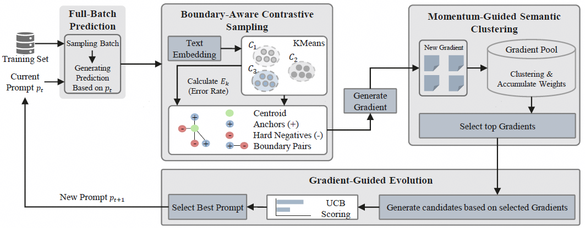

<h1 align="center">C-MOP: Integrating Momentum and Boundary-Aware Clustering for Enhanced Prompt Evolution</h1>

<p align="center">
  
</p>

---

## 📌 Table of Contents
* [Overview](#overview)
* [Installation](#installation)
* [Quick Start](#quick-start)
* [Main Results](#main-results)


## Overview

**C-MOP** (Cluster-based Momentum Optimized Prompting) is an advanced framework for stable automatic prompt evolution that utilizes boundary-aware sampling and a temporal momentum mechanism to optimize LLM prompt.
<div align="center">

</div><br/>


**Key Features:**

* 🎯 **Boundary-Aware Sampling** — Extracts *Hard Negatives*, *Anchors*, and *Boundary Pairs* to acquire more informative instance.
* 📈 **Temporal Momentum** — Maintains a historical gradient pool with time-decay weights to stabilize optimization.

---

## Installation
Refer to the following steps for environment dependency installation.

1) Clone the repository
```bash
# Clone the repository
git clone https://github.com/huawei-noah/noah-research/tree/master/C-MOP.git
cd C-MOP
```

2) Create and activate a virtual environment
```bash
conda create --name venv python=3.10
conda activate venv
```

3) Install the dependency
```bash
pip install -r requirements.txt
```

To deploy online inference services API for models such as [qwen3](https://huggingface.co/Qwen/Qwen3-30B-A3B-Thinking-2507) and [openpangu](https://ai.gitcode.com/ascend-tribe/openPangu-Embedded-7B-V1.1/tree/main) via vLLM or vLLM-Ascend, please refer to their respective repositories to install the required environment and dependencies.

---

## Quick Start
The project requires two model endpoints (Task Model and Optimizer Model). You can host any open-source model using vLLM or vLLM-Ascend to provide an OpenAI-compatible API.

1) **Deploy your models**: Ensure your inference services are running.

2) **Configure Environment**: Create a `.env` file in the `C-MOP` root directory.

3) **Setup Credentials**: Define your model URLs, names, and API keys as follows:

```
# --- Task Model ---
TASK_MODEL_URL="http://127.0.0.1:8000/v1"
TASK_MODEL_NAME="Qwen3-30B-A3B-Instruct-2507"
TASK_MODEL_APIKEY="empty"

# --- Optimizer Model ---
OPTIMIZER_MODEL_URL="http://127.0.0.1:8001/v1"
OPTIMIZER_MODEL_NAME="Qwen3-30B-A3B-Thinking-2507"
OPTIMIZER_MODEL_APIKEY="empty"
```
Before running the project, you must download the `all-MiniLM-L6-v2` [embedding model](https://huggingface.co/sentence-transformers/all-MiniLM-L6-v2) and ensure the model is placed exactly in the `embedding_model/all-MiniLM-L6-v2` directory.

The primary way to start with the project is through the `start_main.sh` script. To start the overall process, run:
```bash
sh start_main.sh
```

To run different tasks, simply modify the `task` argument. More key arguments are defined in `utils/helpers.py`, while the default prompts and meta-prompts are stored in `utils/prompt.py`.
```python
## utils/prompt.py
DEFAULT_SYSTEM_PROMPT = "Your initial prompt"
```

---

## Main Results

Our experiments across diverse benchmarks (BBH, GSM8K, Liar) demonstrate that C-MOP consistently outperforms existing methods:

| Method | Task Model | Optimizer Model | BBH | GSM8K | Liar | Avg |
| :--- | :---: | :---: | :---: | :---: | :---: | :---: |
| Zero-shot (Base) | Qwen3-30B-A3B-Instruct-2507 | - | 81.65±0.14 | 80.67±0.47 | 40.92±0.33 | 67.75 |
| ProTeGi | Qwen3-30B-A3B-Instruct-2507 | Qwen3-30B-A3B-Thinking-2507 | 82.63±1.27 | 95.07±0.20 | 58.47±0.43 | 78.72 |
| PromptWizard | Qwen3-30B-A3B-Instruct-2507 | Qwen3-30B-A3B-Thinking-2507 | 85.34±1.51 | 94.54±0.68 | 61.61±0.62 | 80.50 |
| SPO | Qwen3-30B-A3B-Instruct-2507 | Qwen3-30B-A3B-Thinking-2507 | 84.13±1.31 | 93.00±1.01 | 59.38±3.07 | 78.84 |
| GPO | Qwen3-30B-A3B-Instruct-2507 | Qwen3-30B-A3B-Thinking-2507 | 82.61±1.61 | 95.04±0.79 | 57.85±3.53 | 78.50 |
| C-MOP (Ours) | Qwen3-30B-A3B-Instruct-2507 | Qwen3-30B-A3B-Thinking-2507 | **86.24±0.41** | **95.53±0.20** | **64.46±0.68** | **82.08** |


Furthermore, in the Financial domain, C-MOP optimized the Qwen3-30B-A3B-Instruct model to outperform the 70B domain-specific XuanYuan2-70B model, as well as GPT-4 model.

| Model | Type | Accuracy (%) |
| :--- | :---: | :---: |
| XuanYuan2-70B-Base | Domain-Specific | 56.69 |
| GPT-4 | Closed-Source | 56.77 |
| Qwen3-30B-A3B-Instruct-2507 | General | 52.49 |
| Qwen3-30B-A3B-Instruct-2507 (+ C-MOP) | General + Opt | 60.20 |

To demonstrate the generalization capabilities of C-MOP, we evaluated the method across various task models with different architectures and parameter scales:

| Task Model | Zero-shot (Base) | w/ C-MOP | $\Delta$ |
| :--- | :---: | :---: | :---: |
| Qwen3-8B (Non-Thinking) | 44.03 | 58.79 | +14.76 |
| Llama-3.1-8B-Instruct | 45.34 | 61.83 | +16.49 |
| Qwen3-30B-A3B-Instruct-2507 | 40.92 | 64.46 | +23.54 |
| openPangu-Embedded-7B-V1.1 | 50.97 | 60.95 | +9.98 |
---


## Acknowledgement

We thank the contributors of [ProTeGi](https://github.com/microsoft/LMOps/tree/main/prompt_optimization) for their inspiring work in the field of automatic prompt optimization.

## License

This project is licensed under the **Apache License 2.0** - see the [LICENSE](assets/License.txt) file for details.