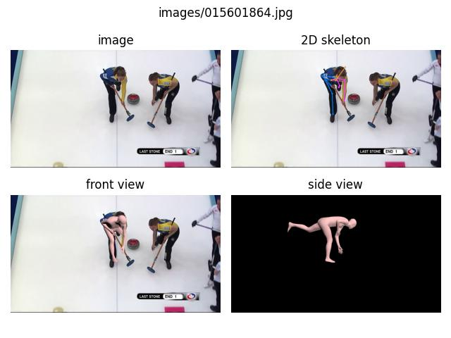

# CLIFF Official Implementation [ECCV 2022 Oral]

[](https://paperswithcode.com/sota/3d-human-pose-estimation-on-3dpw?p=cliff-carrying-location-information-in-full)
[](https://youtu.be/e8neN405UsY)
[](https://youtu.be/UBqhTHYPoOo)


*(This testing video is from the 3DPW testset, and processed frame by frame without temporal smoothing.)*

## Introduction
This repo contains the demo code, 
and the pseudo-GT SMPL parameters used in the training for the paper:

[**CLIFF: Carrying Location Information in Full Frames into Human Pose and Shape Estimation**](
    https://arxiv.org/abs/2208.00571
).

## Installation
```bash
conda create -n cliff python=3.10
pip install -r requirements.txt
```

1. Download [the SMPL models](https://smpl.is.tue.mpg.de) for rendering the reconstructed meshes
2. Download [pytorch-yolo-v3](https://github.com/ayooshkathuria/pytorch-yolo-v3), 
   unzip it under the `lib` directory, and change the folder name to **"pytorch_yolo_v3_master"**
3. Download the pretrained checkpoints and some testing samples to run the demo [[Google Drive](
    https://drive.google.com/drive/folders/1EmSZwaDULhT9m1VvH7YOpCXwBWgYrgwP?usp=sharing)]
4. Download the CLIFF pseudo-GT for the in-the-wild datasets [[Google Drive](
    https://drive.google.com/drive/folders/1EmSZwaDULhT9m1VvH7YOpCXwBWgYrgwP?usp=sharing)]

Finally put these data following the directory structure as below:
```
${ROOT}
|-- cliffGT_v1
    |-- coco2014part_cliffGT.npz
    |-- mpii_cliffGT.npz
|-- data
    |-- ckpt
        |-- hr48-PA43.0_MJE69.0_MVE81.2_3dpw.pt
        |-- res50-PA45.7_MJE72.0_MVE85.3_3dpw.pt
        |-- yolov3.weights
        |-- hr48-PA53.7_MJE91.4_MVE110.0_agora_val.pt
    |-- smpl
        |-- SMPL_FEMALE.pkl
        |-- SMPL_MALE.pkl
        |-- SMPL_NEUTRAL.pkl
|-- lib
    |-- pytorch_yolo_v3_master
```

## Demo


```shell
sh scripts/run_demo.sh
```

<p float="left">
   
   
   
   
</p>

<p float="left">
   
   
   
   
</p>

The results will be saved in the same directory as the input, including the detected bbox, 
the front-view and side-view rendering of the reconstructed meshes, 
and the npz file containing all the estimation information. 

One can change the demo options in the script. 
Please see the option description in the bottom lines of `demo.py`.

## Pseudo-GT

<p float="left">
   
   
</p>

Run the script to visualize the pseudoGT, press the `<-` and `->` button to the next sample, and `esc` to exit.

```shell
sh scripts/run_cliffGT_visualization.sh
```

<p float="left">
   
   
</p>

Data format: 
```
'imgname':     # image name, e.g., images/015601864.jpg, train2014/COCO_train2014_000000044474.jpg 
'center':      # bbox center, [x, y]
'scale':       # bbox scale, bbox_size_in_pixel / 200.
'part':        # 2D keypoint annotation, shape (24, 3), [x, y, conf], see common/skeleton_drawer.py for the order
'annot_id':    # annotation ID, only available for the COCO dataset
'pose':        # SMPL pose parameters in axis-angle, shape (72,)
'shape':       # SMPL shape parameters, shape (10,)
'has_smpl':    # whether the smpl parameters are available (true for all samples)
'global_t':    # Pelvis translation in the camera coordinate system w.r.t the original full-frame image
'focal_l':     # estimated focal length for the original image, np.sqrt(img_w ** 2 + img_h ** 2)
'S':           # 3D joints with Pelvis aligned at (0, 0, 0), shape (24, 4), [x, y, z, conf], same order as 'part'
```

## Issues
When submitting an issue, please add **"[CLIFF]"** before the title, e.g., `[CLIFF] your issue title`.
This is for clarifying which subproject the issue points to.

## Other Implementations
- [BEDLAM](https://github.com/pixelite1201/BEDLAM): training, evaluation, demo
- [MMHuman3D](https://github.com/open-mmlab/mmhuman3d/tree/main/configs/cliff): training, evaluation, demo
- [haofanwang](https://github.com/haofanwang/CLIFF): demo

## Citing
```
@Inproceedings{li2022cliff,
  Title     = {CLIFF: Carrying Location Information in Full Frames into Human Pose and Shape Estimation},
  Author    = {Li, Zhihao and Liu, Jianzhuang and Zhang, Zhensong and Xu, Songcen and Yan, Youliang},
  Booktitle = {ECCV},
  Year      = {2022}
}
```

【This open source project is not an official Huawei product, Huawei is not expected to provide support for this project.】
