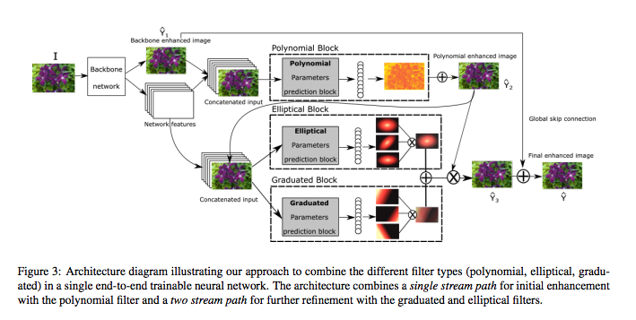
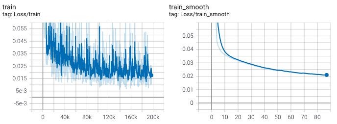

# DeepLPF: Deep Local Parametric Filters for Image Enhancement (CVPR 2020)

[Sean Moran](http://www.seanjmoran.com), Pierre Marza, [Steven McDonagh](https://smcdonagh.github.io), [Sarah Parisot](https://parisots.github.io/), [Greg Slabaugh](http://gregslabaugh.net/)

Huawei Noah's Ark Lab

### [[Paper]](https://arxiv.org/abs/2003.13985) 
### [[Video]](https://www.youtube.com/watch?v=Sxach3FM6FY) 
### [[Supplementary]](http://www.seanjmoran.com/pdfs/DeepLPF_supplementary.pdf) 

<p align="center">

</p>
Repository for the paper DeepLPF: Deep Local Parametric Filters for Image Enhancement. Here you will find a link to the code and information on the datasets. Please raise a Github issue if you need assistance of have any questions on the research. 
<p></p>

### Requirements

_requirements.txt_ contains the Python packages used by the code.

### How to train DeepLPF and use the model for inference

#### Training DeepLPF

Instructions:

To get this code working on your system / problem you will need to edit the data loading functions, as follows:

1. main.py, change the paths for the data directories to point to your data directory
2. data.py, lines 248, 256, change the folder names of the data input and output directories to point to your folder names

To train, run the command:

```
python3 main.py
```

<p align="center">

</p>

#### Inference - Using Pre-trained Models for Prediction

The directory _pretrained_models_ contains a set of four DeepLPF pre-trained models on the _Adobe5K_DPE dataset_, each model output from different epochs. The model with the highest validation dataset PSNR (23.94 dB) is at epoch 500:

* deeplpf_validpsnr_23.31_validloss_0.033_testpsnr_23.94_testloss_0.031_epoch_499_model.pt

This model achieves a PSNR of 23.94dB and an SSIM of 0.913 on the Adobe_DPE image dataset. To inference with this model, follow these instructions:

1. Place the images you wish to infer in a directory e.g. ./adobe5k_dpe/deeplpf_example_test_input/. Make sure the directory path has the word "input" somewhere in the path.
2. Place the images you wish to use as groundtruth in a directory e.g. ./adobe5k_dpe/deeplpf_example_test_output/. Make sure the directory path has the word "output" somewhere in the path.
3. Place the names of the images (without extension) in a text file in the directory above the directory containing the images i.e. ./adobe5k_dpe/ e.g. ./adobe5k_dpe/images_inference.txt
4. Run the command and the results will appear in a timestamped directory in the same directory as main.py:

```
python3 main.py --inference_img_dirpath=./adobe5k_dpe/ --checkpoint_filepath=./pretrained_models/deeplpf_validpsnr_23.31_validloss_0.033_testpsnr_23.94_testloss_0.031_epoch_499_model.pt
```

### Bibtex

```
@InProceedings{Moran_2020_CVPR,
author = {Moran, Sean and Marza, Pierre and McDonagh, Steven and Parisot, Sarah and Slabaugh, Gregory},
title = {DeepLPF: Deep Local Parametric Filters for Image Enhancement},
booktitle = {Proceedings of the IEEE/CVF Conference on Computer Vision and Pattern Recognition (CVPR)},
month = {June},
year = {2020}
}
```

### Datasets

* __Adobe-DPE__ (5000 images, RGB, RGB pairs): this dataset can be downloaded [here](https://data.csail.mit.edu/graphics/fivek/). After downloading this dataset you will need to use Lightroom to pre-process the images according to the procedure outlined in the DeepPhotoEnhancer (DPE) [paper](https://github.com/nothinglo/Deep-Photo-Enhancer). Please see the issue [here](https://github.com/nothinglo/Deep-Photo-Enhancer/issues/38#issuecomment-449786636) for instructions. Artist C retouching is used as the groundtruth/target. Note, the images must be extracted in sRGB space. Feel free to raise a Gitlab issue if you need assistance with this (or indeed the Adobe-UPE dataset below). You can also find the training, validation and testing dataset splits for Adobe-DPE in the following [file](https://www.cmlab.csie.ntu.edu.tw/project/Deep-Photo-Enhancer/%5BExperimental_Code_Data%5D_Deep-Photo-Enhancer.zip). The splits can also be found the the [adobe5k_dpe](./adobe5k_dpe/) directory in this repository (note these are a best guess at what the orginal splits from the DPE authors might be).

* __Adobe-UPE__ (5000 images, RGB, RGB pairs): this dataset can be downloaded [here](https://data.csail.mit.edu/graphics/fivek/). As above, you will need to use Lightroom to pre-process the images according to the procedure outlined in the Underexposed Photo Enhancement Using Deep Illumination Estimation (DeepUPE) [paper](https://github.com/wangruixing/DeepUPE) and detailed in the issue [here](https://github.com/wangruixing/DeepUPE/issues/26). Artist C retouching is used as the groundtruth/target. You can find the test images for the Adobe-UPE dataset at this [link](https://drive.google.com/file/d/1HZnNgptNxjKJAhekz2K5yh0mW0yKIws2/view?usp=sharing).

### License

BSD-3-Clause License

### Contributions

We appreciate all contributions. If you are planning to contribute back bug-fixes, please do so without any further discussion.

If you plan to contribute new features, utility functions or extensions to the core, please first open an issue and discuss the feature with us. Sending a PR without discussion might end up resulting in a rejected PR, because we might be taking the core in a different direction than you might be aware of.

Copyright (C) 2020. Huawei Technologies Co., Ltd. All rights reserved. THE SOFTWARE IS PROVIDED "AS IS" AND THE AUTHOR DISCLAIMS ALL WARRANTIES WITH REGARD TO THIS SOFTWARE INCLUDING ALL IMPLIED WARRANTIES OF MERCHANTABILITY AND FITNESS. IN NO EVENT SHALL THE AUTHOR BE LIABLE FOR ANY SPECIAL, DIRECT, INDIRECT, OR CONSEQUENTIAL DAMAGES OR ANY DAMAGES WHATSOEVER RESULTING FROM LOSS OF USE, DATA OR PROFITS, WHETHER IN AN ACTION OF CONTRACT, NEGLIGENCE OR OTHER TORTIOUS ACTION, ARISING OUT OF OR IN CONNECTION WITH THE USE OR PERFORMANCE OF THIS SOFTWARE.
