# SOP2Workflow: From SOP Documents to Executable Agent Workflows

Industrial processes are often written as **Standard Operating Procedures (SOPs)** —  
structured documents describing how tasks should be executed step by step.

However, SOPs are usually **static text**, meaning:

- they cannot be directly executed,
- they require manual workflow engineering,
- and they are difficult to scale into agent-based automation systems.

**SOP2Workflow** is an EvoFabric application module designed to solve this gap.

---

## 🎯 What SOP2Workflow Does

SOP2Workflow automatically transforms a textual SOP into a runnable multi-agent workflow graph.

It enables:

- **SOP → Workflow automation**  
  Convert business documents into executable agent pipelines.

- **Node-level modularization**  
  Break complex procedures into coherent agent nodes.

- **Tool & Memory allocation per node**  
  Each workflow node can be equipped with specific tools and memory modules.

- **Editable and evolvable workflows**  
  Generated workflow definitions are saved to disk and can be refined manually.

- **End-to-end execution support**  
  From document parsing → graph generation → agent execution → visualization.

---

## 🧠 Core Principle

SOP2Workflow follows a two-stage generation strategy:

### 1. SOP Decomposition & Workflow Skeleton Construction

The SOP is decomposed into:

- **Global instructions** (overall rules, constraints, format requirements)
- **Local instructions** (step-level task descriptions)

Then the system groups local instructions into functional nodes and builds a valid
graph structure from `start` to `end`.

The decomposition result is saved as:

```

output_dir/_sop_breakdown.yaml

```

---

### 2. Node Completion & Resource Assignment

Each node is completed by an LLM using context such as:

- node responsibility
- routing structure
- available tools and memory modules
- other node roles

The system generates:

- node-specific system prompts
- tool selection
- memory assignment
- routing decisions

Finally, an executable EvoFabric workflow graph is assembled.

```mermaid
flowchart TD
    subgraph Inputs[Inputs]
        SOP[SOP document]
        Tools[Tool sets]
        Memory[Memory sets]
    end

  subgraph SOP_Decomposition["SOP → Workflow Definition"]
    SOP["SOP Document"]
    GlobalInstruction["Global Instruction<br>(High-level operational goals)"]
    NodeDef["Agent Node Definitions<br>(roles, inputs, outputs)"]
    Routing["Routing Messages<br>(conditions, triggers, data links)"]
  end

  subgraph Refine_nodes["Node Instruction → Complete Agent Node"]
    Full_instruction["Full instruction: <br>Global Instruction + Node Instruction + Routing Rules"]
    Tool_depend["Tool Dependencies"]
    Memories_depend["Memory Dependencies"]
  end

    Inputs -->|SOP Decomposition| SOP_Decomposition
    SOP_Decomposition --> |Nodes Refine | Refine_nodes
    Refine_nodes --> Step3
    Step3[Build GraphEngine]

    class Inputs inputs;
```



---
## 📌 Examples

#### Preparation

We built an example based on the SOP data from [SOP-Bench](https://arxiv.org/abs/2506.08119).

Download the codes and format your directory structure as follows (except for the output folder):

```

examples/sop2workflow/
│
├── readme.md                     # this document
├── example_on_sop_bench.py        # main runnable script
│
├── customer_service_sop/
│   ├── sop.txt                   # This file defines the procedure to be converted into an agent workflow
│   └── tool_mcp.py               # MCP tool server definition
│
└── output/
└── customer_service_sop/     # generated workflow artifacts
```

## 🔑 Environment Setup
Write the following environment variables to `.env` file.
```ini
OPENAI_API_KEY=your_key_here
OPENAI_BASE_URL=https://api.openai.com/v1
```

## 🚀 Run
Run the script:

```bash
python examples/sop2workflow/example_on_sop_bench.py
```

The workflow generator will:

1. Decompose the SOP
2. Build a workflow skeleton
3. Complete node-level prompts, routing, tool usage
4. Save intermediate artifacts
5. Execute the graph

## 🧩 Workflow Visualization

The generated workflow graph can be visualized via:

```python
graph.draw_graph()
```

For more details, check our [document](https://evofabric.readthedocs.io/en/latest/Applications/sop2workflow.html)
