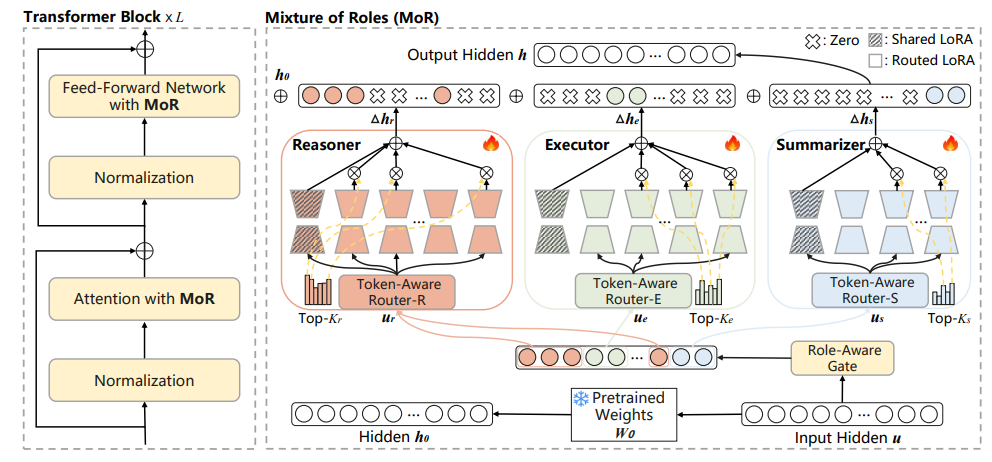
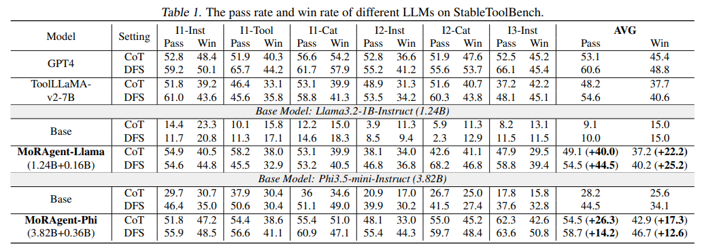
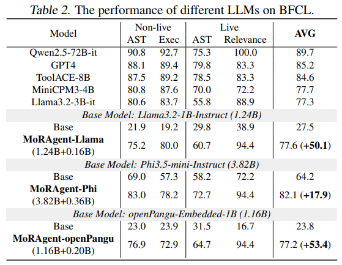
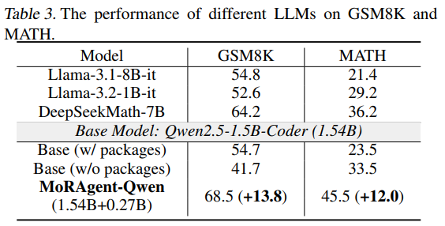

# MoRAgent: Parameter Efficient Agent Tuning with Mixture-of-Roles
By Jing Han, Binwei Yan, Tianyu Guo, Zheyuan Bai, Mengyu Zheng, Hanting Chen and Ying Nie.

## 💡 Introduction

We introduce **MoRAgent: Parameter Efficient Agent Tuning with Mixture-of-Roles**, a novel framework designed to enhance agent performance and efficiency by addressing the limitations of general PEFT methods in complex sequential reasoning tasks.MoRAgent achieves this through dual mechanisms:

**Capability Decomposition:** We break down agent tasks into three specialized roles—**Reasoner**, **Executor**, and **Summarizer**—to focus tuning on distinct capabilities (comprehension, function calling, and final output). 

**Mixture-of-Roles (MoR) Tuning:** This framework employs three specialized **Low-Rank Adaptation (LoRA)** groups, each dedicated to a distinct role. These groups collaboratively accomplish the overall agent task through targeted, efficient parameter updates, supported by a novel multi-role data generation pipeline.

---

### 🖼️ Framework Overview

🛠 Core Architecture Refactoring: The primary innovation of MoRAgent is implemented through the custom redesign of the ```MoeLoraLayer``` and ```LinearMoELora``` classes in ```moelora.py```. We have transformed the standard MoELora from a monolithic expert pool into a structured, task-aware expert system.

The following diagram illustrates the architecture of MoRAgent:

<div align="center">
  
</div><br/>


### 📊 Main Results

The results on StableToolBench:

<div align="center">
  
</div><br/>

The results on BFCL:

<div align="center">
  
</div><br/>

The results on GSM8K and MATH:

<div align="center">
  
</div><br/>

---

## 🙏 Acknowledgements
This project is built upon the foundation of outstanding open-source work. We sincerely thank the developers of the following projects for their contributions:
- **[Neeko](https://github.com/weiyifan1023/Neeko/tree/main/moelora):** For insights into Mixture-of-Experts (MoE) and related tuning methodologies, particularly in the moelora implementation.

## 📝 Citation
If you find this work useful for your research, please consider citing our paper:

```bibtex
@inproceedings{hanmoragent,
  title={MoRAgent: Parameter Efficient Agent Tuning with Mixture-of-Roles},
  author={Han, Jing and Yan, Binwei and Guo, Tianyu and Bai, Zheyuan and Zheng, Mengyu and Chen, Hanting and Nie, Ying},
  booktitle={Forty-second International Conference on Machine Learning}
}
```