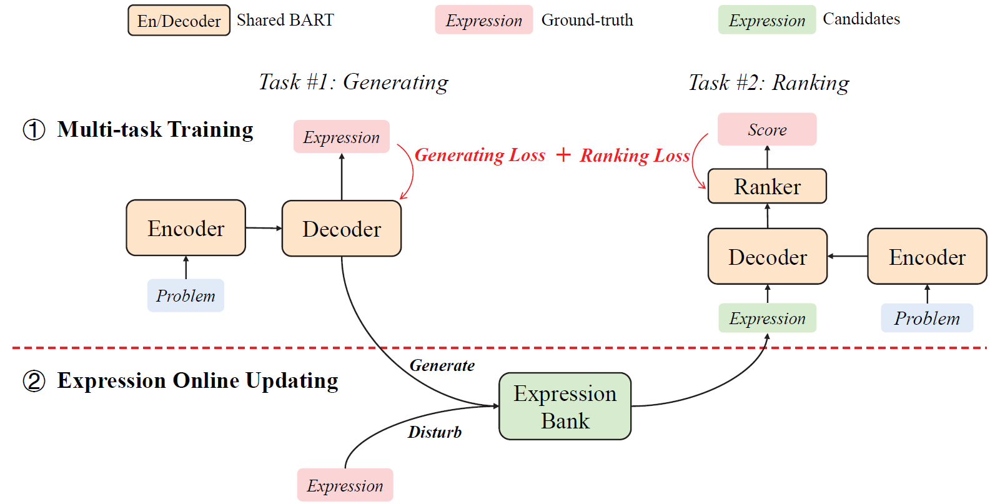

# Generate & Rank: A Multi-task Framework for Math Word Problems (Findings of EMNLP 2021)

## Overview
 
Generate & Rank is a multi-task framework for math word problems (MWP) based on a generative pre-trained language model. 
By joint training with generation and ranking, the model learns from its own mistakes and is able to distinguish between correct and incorrect expressions
Our framework is illustrated as follows:



For more details, please refer to our paper:

[Generate & Rank: A Multi-task Framework for Math Word Problems](https://aclanthology.org/2021.findings-emnlp.195/)


## Installation
First install pytorch>=1.4 (https://pytorch.org/), then run command below to install the environment
```bash
pip install -r requirements.txt
```


## Train

Step 1: use `train_gen.py` to train generator with seq2seq loss
```
python -m torch.distributed.launch \
    --nproc_per_node=8 \
    train_gen.py \
    --train_file ${train_data} \
    --valid_file ${valid_data} \
    --test_file ${test_data} \
    --output_dir ${output_dir} \
    --model_path mbart-large-cc25 \
    --max_source_length 200 \
    --max_target_length 128 \
    --learning_rate 5e-5 \
    --num_train_epochs 50 \
    --logging_steps 100 \
    --per_gpu_train_batch_size 4 \
    --src_lang zh_CN \
    --tgt_lang en_XX \
    --test_per_epoch 1
```

Step 2: use `train_gen_rank.py` to train Generate & Rank  with joint loss 
```
python -m torch.distributed.launch \
    --nproc_per_node=8 \
    train_gen_rank.py \
    --train_file ${train_data} \
    --valid_file ${valid_data} \
    --test_file ${test_data} \
    --output_dir ${output_dir} \
    --model_path ${generator_model_path} \
    --max_source_length 200 \
    --max_target_length 128 \
    --learning_rate 5e-5 \
    --num_train_epochs 50 \
    --logging_steps 100 \
    --per_gpu_train_batch_size 16 \
    --src_lang zh_CN \
    --tgt_lang en_XX \
    --test_per_epoch 1 \
    --regenerate 1 \
    --rule_negatives 1 \
    --num_negatives 10

```

## Reference

Please cite our paper if you use our models in your works:
```
@inproceedings{shen-etal-2021-generate-rank,
    title = "Generate {\&} Rank: A Multi-task Framework for Math Word Problems",
    author = "Shen, Jianhao  and
      Yin, Yichun  and
      Li, Lin  and
      Shang, Lifeng  and
      Jiang, Xin  and
      Zhang, Ming  and
      Liu, Qun",
    booktitle = "Findings of the Association for Computational Linguistics: EMNLP 2021",
    year = "2021",
    pages = "2269--2279",
}
```
