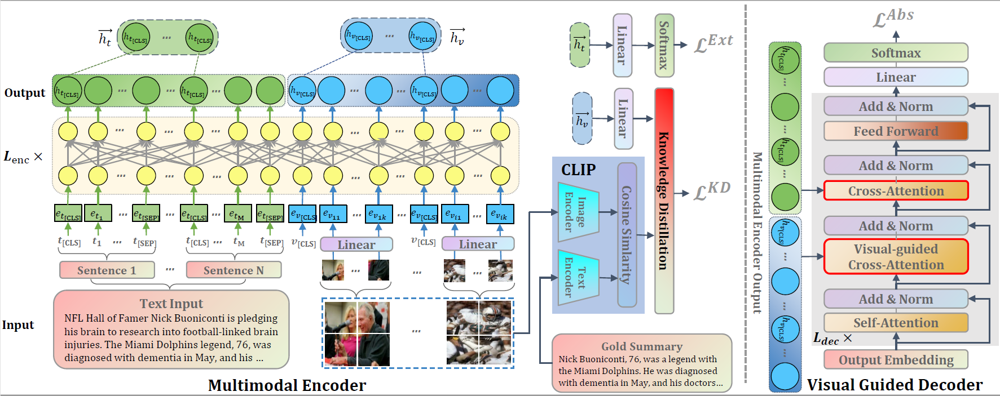

# UniMS

---

Code for the AAAI 2022 paper: "UniMS: A Unified Framework for Multimodal Summarization with Knowledge Distillation"




## Setup

---

```bash
# Create python environment (optional)
conda create -n unims python=3.7
source activate unims

# Install python dependencies
pip install -r requirements.txt
```

## Data Preparation

---

We use [MSMO: Multimodal Summarization with Multimodal Output](https://aclanthology.org/D18-1448.pdf) datasets.

Download MSMO datasets from [website](http://www.nlpr.ia.ac.cn/cip/dataset.htm).

### Make Pseudo Labels

```bash
sh ./scripts/data.sh
```

## Train

---

```bash
sh ./scripts/train.sh
```

## Test

---

```bash
sh ./scripts/test.sh
```


## Reference

---

Please cite our paper if you use our models in your works:
```
@article{zhang2022unims,
  author    = {Zhengkun Zhang and
               Xiaojun Meng and
               Yasheng Wang and
               Xin Jiang and
               Qun Liu and
               Zhenglu Yang},
  title     = {UniMS: A Unified Framework for Multimodal Summarization with Knowledge Distillation},
  booktitle = {AAAI},
  year      = {2022}
}
```

