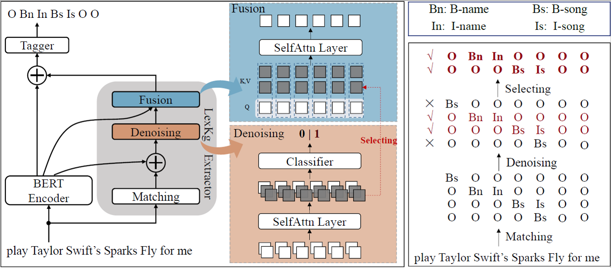

# DyLex: Incorporating Dynamic Lexicons into BERT for Sequence Labeling


Incorporating lexical knowledge into deep learning models has been proved to be very effective for sequence labeling tasks. However, previous works commonly have difficulty dealing with large-scale dynamic lexicons which often cause excessive matching noise and problems of frequent updates. 

We propose DyLex, a plug-in lexicon incorporation approach for BERT based sequence labeling tasks. Instead of leveraging embeddings of words in the lexicon as in conventional methods, we adopt word-agnostic tag embeddings to avoid re-training the representation while updating the lexicon. Moreover, we employ an effective supervised lexical knowledge denoising method to smooth out matching noise.

This directory contains code for Dylex(EMNLP2021 long).

## ENVS
conda create -n myenv python=3.6  
conda activate myenv  
pip install -r requirements.txt  

## Train

```bash
python mian.py 
    --data_dir=path_to_data \
    --dict_path=path_to_dict \
    --model_name_or_path=path_to_bert \
    --do_train=yes \
    --eval_bs_per_gpu=16 \
    --eval_per_n=100 \
    --log_per_n=10
    --lr=5e-5 \
    --match_num=1 \
    --max_dict_num=16 \
    --num_train_epochs=30 \
    --output_dir=outputs \
    --overwrite_output=yes \
    --train_bs_per_gpu=16 \
    --train_max_seq_length=256 \
    --use_subword=yes \
    --warmup_proportion=0.15 \
    --weight_decay=0.01 \
```

## Reference 
> @inproceedings{wang-etal-2021-dylex,
    title = "{D}y{L}ex: Incorporating Dynamic Lexicons into {BERT} for Sequence Labeling",
    author = "Wang, Baojun  and
      Zhang, Zhao  and
      Xu, Kun  and
      Hao, Guang-Yuan  and
      Zhang, Yuyang  and
      Shang, Lifeng  and
      Li, Linlin  and
      Chen, Xiao  and
      Jiang, Xin  and
      Liu, Qun",
    booktitle = "Proceedings of the 2021 Conference on Empirical Methods in Natural Language Processing",
    month = nov,
    year = "2021",
    address = "Online and Punta Cana, Dominican Republic",
    publisher = "Association for Computational Linguistics",
    url = "https://aclanthology.org/2021.emnlp-main.211",
    pages = "2679--2693",
    abstract = "Incorporating lexical knowledge into deep learning models has been proved to be very effective for sequence labeling tasks. However, previous works commonly have difficulty dealing with large-scale dynamic lexicons which often cause excessive matching noise and problems of frequent updates. In this paper, we propose DyLex, a plug-in lexicon incorporation approach for BERT based sequence labeling tasks. Instead of leveraging embeddings of words in the lexicon as in conventional methods, we adopt word-agnostic tag embeddings to avoid re-training the representation while updating the lexicon. Moreover, we employ an effective supervised lexical knowledge denoising method to smooth out matching noise. Finally, we introduce a col-wise attention based knowledge fusion mechanism to guarantee the pluggability of the proposed framework. Experiments on ten datasets of three tasks show that the proposed framework achieves new SOTA, even with very large scale lexicons.",
}

【This open source project is not an official Huawei product, Huawei is not expected to provide support for this project.】