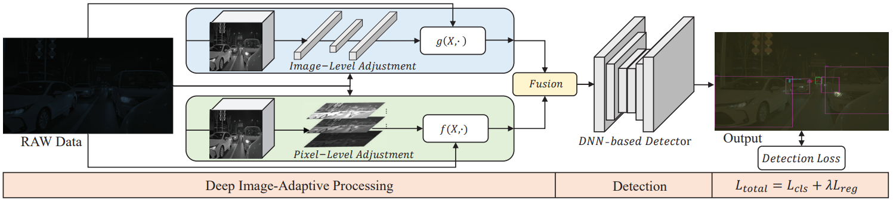

# Contents

- [Contents](#contents)
- [RAOD (CVPR 2023)](#raod-cvpr-2023)
    - [1 Authors](#1-authors)
    - [2 Downloads](#2-downloads)
    - [3 Abstract](#3-abstract)
    - [4 Framework](#4-framework)
    - [5 Usage](#5-usage)
        - [5.1 Requirements](#51-requirements)
        - [5.2 Preparations](#52-preparations)
        - [5.3 Training and Evalutation](#53-training-and-evalutation)
    - [6 Notification](#6-notification)
    - [7 License](#7-license)
    - [8 Citation](#8-citation)

# [RAOD (CVPR 2023)](#raod-cvpr-2023)
Official PyTorch implementation of **RAOD**.

## [1 Authors](#1-authors)
Ruikang Xu*, Chang Chen*, Jingyang Peng*, Cheng Li, Yibin Huang, Fenglong Song, Youliang Yan, and [Zhiwei Xiong#](http://staff.ustc.edu.cn/~zwxiong)  
(*Equal contribution, #Corresponding author)

## [2 Downloads](#2-downloads)
[Paper](https://openaccess.thecvf.com/content/CVPR2023/papers/Xu_Toward_RAW_Object_Detection_A_New_Benchmark_and_a_New_CVPR_2023_paper.pdf), [Supplementary](https://openaccess.thecvf.com/content/CVPR2023/supplemental/Xu_Toward_RAW_Object_CVPR_2023_supplemental.pdf), [Dataset](https://openi.pcl.ac.cn/innovation_contest/innov202305091731448/datasets?lang=en-US).

The above dataset is an example of how we train our RAOD model. Feel free to use your own data. Please see section [Notification](#6-notification) for more information.


## [3 Abstract](#3-abstract)
In many computer vision applications (e.g., robotics and
autonomous driving), high dynamic range (HDR) data is
necessary for object detection algorithms to handle a variety of lighting conditions, such as strong glare. In this paper, we aim to achieve object detection on RAW sensor data, which naturally saves the HDR information from image sensors without extra equipment costs. We build a novel RAW sensor dataset, named ROD, for Deep Neural Networks (DNNs)-based object detection algorithms to be applied to HDR data. The ROD dataset contains a large amount of annotated instances of day and night driving scenes in 24-bit dynamic range. Based on the dataset, we first investigate the impact of dynamic range for DNNs-based detectors and demonstrate the importance of dynamic range adjustment for detection on RAW sensor data. Then, we propose a simple and effective adjustment method for object detection on HDR RAW sensor data, which is image adaptive and jointly optimized with the downstream detector in an end-to-end scheme. Extensive experiments demonstrate that the performance of detection on RAW sensor data is significantly superior to standard dynamic range (SDR) data in different situations. Moreover, we analyze the influence of texture information and pixel distribution of input data on the performance of the DNNs-based detector. 

## [4 Framework](#4-framework)


## [5 Usage](#5-usage)

### [5.1 Requirements](#51-requirements)
Codes are tested under python 3.7, torch 1.8.0, and CUDA 10.2.

### [5.2 Preparations](#52-preparations)

We apply some pre-processing on RAW images, including Demosaicing, Resizing, and Gray-World White Balance. Our scripts for RAW preprocessing can be seen [here](./scripts/preprocess_raw.py). We also provide the script for annotation preprocessing [here](./scripts/preprocess_anno.py).

To use our scripts, please arrange your dataset in the following format:
```text
${DATA_PATH}
|-- raws
    |-- 00Train
        |-- name1.raw
        |-- name2.raw
        |-- ...
|-- anno
    |-- 00Train
        |-- name1.json
        |-- name2.json
        |-- ...
```

Then you can get the training data for our RAOD project as follows:
```bash
python scripts/preprocess_raw.py -p DATA_PATH/raws/00Train
python scripts/preprocess_anno.py -p DATA_PATH/anno/00Train
```

It will generate processed RAW images under `<DATA_PATH/raws_debayer_awb_fp32_1280x1280>` and COCO-format annotations at `<DATA_PATH/00Train.json>`. Move this annotation to `<DATA_PATH/annotations/00Train.json>`. Then, make sure that your [configuration](./cfg_small.py) (from L42 to L45) matches your dataset.


### [5.3 Training and Evalutation](#53-training-and-evalutation)
After all these preprocessing, run training and evaluation simply by the following command. We also provide our hyper-parameters for training [here](./cfg_small.py).
```bash
bash start_train.sh
bash start_eval.sh
```

## [6 Notification](#6-notification)
- Our [released dataset](https://openi.pcl.ac.cn/innovation_contest/innov202305091731448/datasets?lang=en-US) is NOT the same as the version mentioned in the [paper](https://openaccess.thecvf.com/content/CVPR2023/papers/Xu_Toward_RAW_Object_Detection_A_New_Benchmark_and_a_New_CVPR_2023_paper.pdf), since part of the dataset is property of HUAWEI. We will NOT release those data in the future.
- We are planning to hold [Robust Raw Object Detection Challenge](https://wvcl.vis.xyz/challenges) @ ICCV 2023, based on our RAOD project and ROD dataset. Thus we resample the training / validation / testing splits. We also take a new sampling manner to improve the degree of difficulty, which is much more challenging than the version used in the paper. We will NOT release the test split before the challenge is over.
- For compensation, we further collected some RAW and corresponding annotations with exactly the same setting.
- Model performance on this new version of the validation dataset is listed in the table below.

| Training data | Params (M) | AP | AR | AP50 | AP75 |
| --- | --- | --- | --- | --- | --- |
| Only Day | 0.90 + 0.08 | 23.6 | 31.3 | 39.3 | 25.1 |
| Only Night | 0.90 + 0.08 | 25.2 | 34.4 | 44.9 | 23.8 |
| Day + Night | 0.90 + 0.08 | 28.1 | 37.7 | 47.0 | 28.7 |

## [7 License](#7-license)
We follow Apache License Version 2.0. Please see the [License](./License) file for more information.

Disclaimer: This is not an officially supported HUAWEI product.

## [8 Citation](#8-citation)
If you find our work helpful, please cite the following paper.
```text
@InProceedings{CVPR2023_ROD,
    author    = {Xu, Ruikang and Chen, Chang and Peng, Jingyang and Li, Cheng and Huang, Yibin and Song, Fenglong and Yan, Youliang and Xiong, Zhiwei},
    title     = {Toward RAW Object Detection: A New Benchmark and A New Model},
    booktitle = {CVPR},
    year      = {2023},
}
```
【This open source project is not an official Huawei product, Huawei is not expected to provide support for this project.】