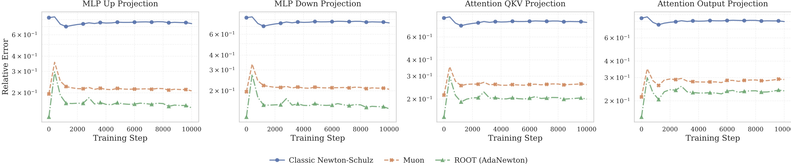

# ROOT: Robust Orthogonalized Optimizer for Neural Network Training
By Wei He, Kai Han, Hang Zhou, Hanting Chen, Zhicheng Liu, Xinghao Chen and Yunhe Wang.  [[arXiv]](https://arxiv.org/abs/2511.20626)

## Overview

**ROOT** (**R**obust **O**rthogonalized **O**p**T**imizer) is a novel optimization algorithm designed to enhance the stability and efficiency of training large-scale neural networks. It addresses two critical limitations in existing orthogonalization-based optimizers (like Muon): **dimensional fragility** and vulnerability to **outlier-induced noise**.

ROOT achieves this through dual robustness mechanisms:

1. **Algorithmic Robustness:** A dimension-robust orthogonalization scheme using adaptive Newton iterations (**AdaNewton**) with coefficients tailored to specific matrix sizes.

2. **Optimization Robustness:** A proximal optimization framework that suppresses outlier noise via **soft-thresholding**.

## ROOT

**Require:** Learning rate $\eta$, momentum $\mu$, threshold $\varepsilon$

1. Initialize $M_0 \leftarrow 0$

2. **for** $t = 1, \dots$ **do**

   * Compute gradient: $G_t \leftarrow \nabla_{\theta}\mathcal{L}(\theta_{t-1})$

   * Momentum accumulation: $M_t \leftarrow \mu M_{t-1} + G_t$

   * Outlier separation via soft-thresholding: $O_t \leftarrow \mathcal{T}_{\varepsilon}[M_t]$

   * Clipped base components: $B_t \leftarrow M_t - O_t$

   * Robust orthogonalization: $B_t^{\text{orth}} \leftarrow \text{AdaNewton}(B_t)$

   * Update parameters: $\theta_t \leftarrow \theta_{t-1} - \eta B_t^{\text{orth}}$

3. **end for**

4. **Return** $\theta_t$

## Keypoints

### 1. Adaptive Newton-Schulz Iteration (AdaNewton)

Standard Newton-Schulz iterations use fixed coefficients that are suboptimal for varying matrix dimensions. ROOT employs shape-specific coefficients optimized for the specific spectral properties of different layers, ensuring consistent orthogonalization precision.



### 2. Proximal Outlier Suppression

Large-scale training often suffers from gradient outliers that destabilize orthogonalization. ROOT incorporates a soft-thresholding mechanism derived from proximal optimization to filter out extreme noise while retaining structural gradient information.

## Quick Start

To run a toy ROOT experiment, you can use the provided example script, this will run a simple training demo of ROOT:

```bash
cd examples
python example_train.py
```

## Citation

If you find this work useful, please cite our paper:

```bibtex
@misc{he2025rootrobustorthogonalizedoptimizer,
      title={ROOT: Robust Orthogonalized Optimizer for Neural Network Training}, 
      author={Wei He and Kai Han and Hang Zhou and Hanting Chen and Zhicheng Liu and Xinghao Chen and Yunhe Wang},
      year={2025},
      eprint={2511.20626},
      archivePrefix={arXiv},
      primaryClass={cs.LG},
      url={https://arxiv.org/abs/2511.20626}, 
}
```
## Acknowledgements
We appreciate the following code bases and conceptual inspiration: [Muon](https://github.com/KellerJordan/Muon), [Moonlight](https://github.com/MoonshotAI/Moonlight), [AdamW](https://github.com/egg-west/AdamW-pytorch).
