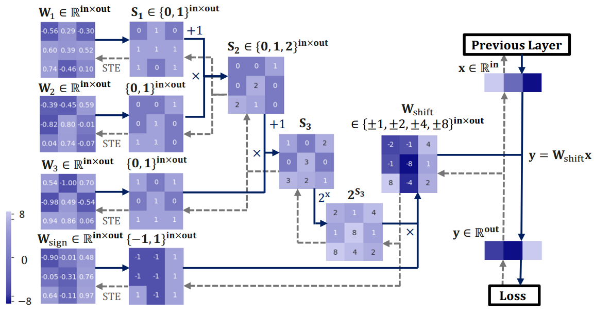

# DenseShift: Towards Accurate and Efficient Low-Bit Power-of-Two Quantization

The DEMO code of the ICCV-2023 paper [DenseShift: Towards Accurate and Efficient Low-Bit Power-of-Two Quantization](https://openaccess.thecvf.com/content/ICCV2023/html/Li_DenseShift_Towards_Accurate_and_Efficient_Low-Bit_Power-of-Two_Quantization_ICCV_2023_paper.html) will be update to this repo soon.

Efficiently deploying deep neural networks on low-resource edge devices is challenging due to their ever-increasing resource requirements. To address this issue, researchers have proposed multiplication-free neural networks, such as Power-of-Two quantization, or also known as Shift networks, which aim to reduce memory usage and simplify computation. However, existing low-bit Shift networks are not as accurate as their full-precision counterparts, typically suffering from limited weight range encoding schemes and quantization loss. In this paper, we propose the DenseShift network, which significantly improves the accuracy of Shift networks, achieving competitive performance to full-precision networks for vision and speech applications. In addition, we introduce a method to deploy an efficient DenseShift network using non-quantized floating-point activations, while obtaining 1.6X speed-up over existing methods. To achieve this, we demonstrate that zero-weight values in low-bit Shift networks do not contribute to model capacity and negatively impact inference computation. To address this issue, we propose a zero-free shifting mechanism that simplifies inference and increases model capacity. We further propose a sign-scale decomposition design to enhance training efficiency and a low-variance random initialization strategy to improve the model's transfer learning performance. Our extensive experiments on various computer vision and speech tasks demonstrate that DenseShift outperforms existing low-bit multiplication-free networks and achieves competitive performance compared to full-precision networks. Furthermore, our proposed approach exhibits strong transfer learning performance without a drop in accuracy.

<p align="center">

</p>

## Requirements

- Install PyTorch ([pytorch.org](http://pytorch.org))
- Download [PyTorch official ImageNet training example](https://github.com/pytorch/examples/tree/master/imagenet).
  - `wget https://raw.githubusercontent.com/pytorch/examples/master/imagenet/main.py`
  - `wget https://raw.githubusercontent.com/pytorch/examples/master/imagenet/requirements.txt`
- `pip install -r requirements.txt`
- Download the ImageNet dataset from http://www.image-net.org/
    - Then, and move validation images to labeled subfolders, using [the following shell script](https://raw.githubusercontent.com/soumith/imagenetloader.torch/master/valprep.sh)

## Running

### 3-bit DenseShift Network on ResNet-18 ImageNet

To train a 3bit DenseShift ResNet-18 on ImageNet from scratch, run:
```train
python main.py /path/to/imagenet
```
