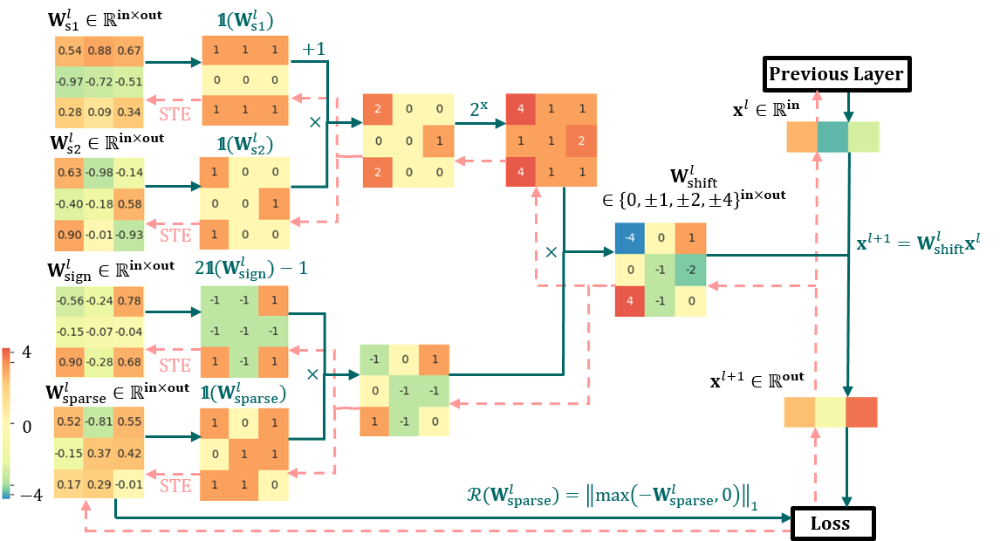
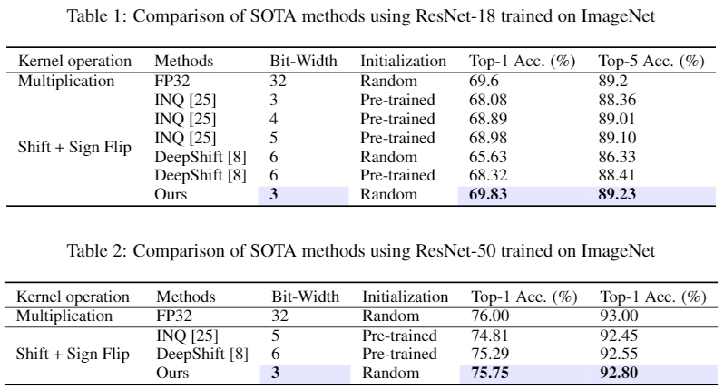

# S3: Sign-Sparse-Shift Reparametrization for Effective Training of Low-bit Shift Networks

This repository is the DEMO code of the NeurIPS 2021 paper [S3: Sign-Sparse-Shift Reparametrization for Effective Training of Low-bit Shift Networks](https://proceedings.neurips.cc/paper/2021/file/7a1d9028a78f418cb8f01909a348d9b2-Paper.pdf).

Shift neural networks reduce computation complexity by removing expensive multiplication operations and quantizing continuous weights into low-bit discrete values, which are fast and energy-efficient compared to conventional neural networks. However, existing shift networks are sensitive to the weight initialization and yield a degraded performance caused by vanishing gradient and weight sign freezing problem. To address these issues, we propose S3 re-parameterization, a novel technique for training low-bit shift networks. Our method decomposes a discrete parameter in a sign-sparse-shift 3-fold manner. This way, it efficiently learns a low-bit network with weight dynamics similar to full-precision networks and insensitive to weight initialization. Our proposed training method pushes the boundaries of shift neural networks and shows 3-bit shift networks compete with their full-precision counterparts in terms of top-1 accuracy on ImageNet.

<p align="center">

</p>

## Requirements

- Install PyTorch ([pytorch.org](http://pytorch.org))
- Download [PyTorch official ImageNet training example](https://github.com/pytorch/examples/tree/master/imagenet).
  - `wget https://raw.githubusercontent.com/pytorch/examples/master/imagenet/main.py`
  - `wget https://raw.githubusercontent.com/pytorch/examples/master/imagenet/requirements.txt`
- `pip install -r requirements.txt`
- Download the ImageNet dataset from http://www.image-net.org/
    - Then, and move validation images to labeled subfolders, using [the following shell script](https://raw.githubusercontent.com/soumith/imagenetloader.torch/master/valprep.sh)

## Training from scratch

### 3-bit Shift Network on ResNet-18 ImageNet

To train a 3bit S3 re-parameterized shift network with ResNet18 on ImageNet from scratch, run:
```train
python main.py /path/to/imagenet
```

## Results

Our model achieves the following performance on :

### Image Classification on ImageNet

#### Results in the paper
<p align="left">

</p>

#### Evaluation code output
| Model name         | Top 1 Accuracy  | Top 5 Accuracy |
| ------------------ |---------------- | -------------- |
| 3-bit Shift ResNet-18 |     69.508%         |      88.968%       |
| 3-bit Shift ResNet-50 |     75.748%         |      92.800%       |

The minor accuracy difference (~0.3%) between Table 1 and the evaluation code output may cause by the difference between our implementation and the PyTorch official ImageNet training example.