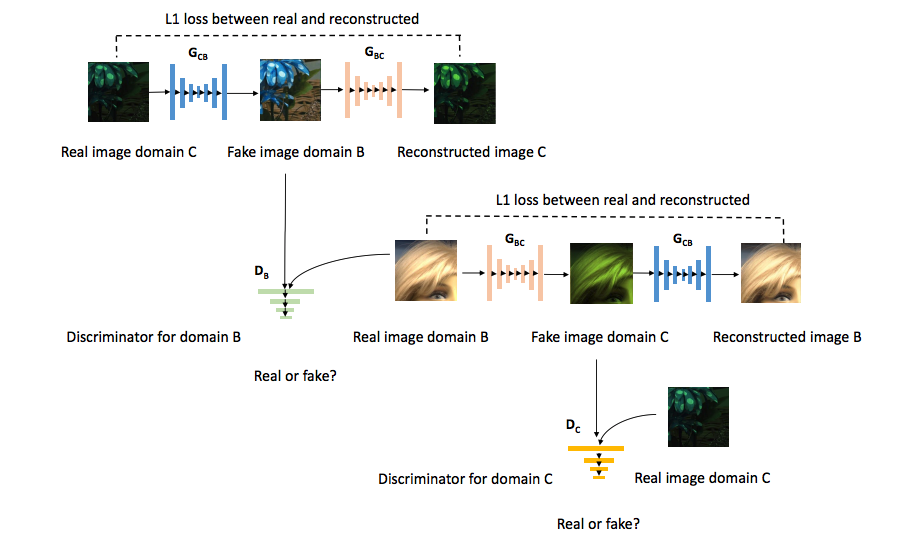

# SIDGAN: Low Light Video Enhancement using Synthetic Data Produced with an Intermediate Domain Mapping (ECCV 2020)

Danai Triantafyllidou, [Sean Moran](http://www.seanjmoran.com), [Steven McDonagh](https://smcdonagh.github.io/), [Sarah Parisot](https://parisots.github.io/), [Greg Slabaugh](http://gregslabaugh.net/)

Huawei Noah's Ark Lab

### [[Paper @ CVF]](https://www.ecva.net/papers/eccv_2020/papers_ECCV/papers/123580103.pdf) 
### [[Video (10 Minutes)]](https://youtu.be/-MwiYBXdtD4) 
<!-- ### [[Video (1 Minute)]](https://youtu.be/mF_ZX0yfMkk) -->
### [[Supplementary @ CVF]](https://www.ecva.net/papers/eccv_2020/papers_ECCV/papers/123580103-supp.zip) 

<p align="center">

</p>
Repository for the ECCV 2020 paper SIDGAN: Low Light Video Enhancement using Synthetic Data Produced with an Intermediate Domain Mapping. Here you will find a link to the code and information on the datasets. Please raise a Github issue if you need assistance of have any questions on the research. 
<p></p>


## Installation

#### 1. Clone the code from Github

Clone the code and place it under $PATH_TO_CODE

```
git clone https://github.com/huawei-noah/noah-research.git
cd SIDGAN

```
 #### 2. Install dependencies

Python: see requirement.txt for complete list of used packages. We recommend doing a clean installation of requirements using virtualenv

```
conda create -n sidganenv python=3.5
source activate sidganenv
pip install -r requirement.txt
```
If you dont want to do the above clean installation via virtualenv, you could also directly install the requirements through:

```
pip install -r requirement.txt --no-index
```

## Running the code

#### 1. Download the data

Please download the [SID Motion](https://github.com/cchen156/Seeing-Motion-in-the-Dark) and [Vimeo-90k](http://toflow.csail.mit.edu/) datasets and create the following folder structure in $PATH_TO_DATA

```
.
└── data
    ├── SID_long
    ├── VBM4D_rawRGB
    └── vimeo
```

#### 2. Running the training code

To train a cycleGAN model for the task of mapping Vimeo videos (domain A) into the SID Motion long exposure (domain B), do:

```
python train_cyclegan_a2b.py --data_root' $PATH_TO_DATA --project_root $PATH_TO_CODE --name $EXP_NAME
```

To train a cycleGAN model for the task of mapping SID Motion long exposure (domain B) into the SID Motion short exposure (domain C), do:

```
python train_cyclegan_b2c.py --data_root' $PATH_TO_DATA --project_root $PATH_TO_CODE --NAME $EXP_NAME
```


Training results will be saved in $PATH_TO_CODE/experiments/$EXP_NAME

```
.
├── images
├── log
├── meta_data.json
└── saved_models
```

## Bibtex

If you find the code useful, please cite this paper:

```
@inproceedings{triantafyllidou2020low,
  title={Low Light Video Enhancement using Synthetic Data Produced with an Intermediate Domain Mapping},
  author={Triantafyllidou, Danai and Moran, Sean and McDonagh, Steven and Parisot, Sarah and Slabaugh, Gregory},
  booktitle={European Conference on Computer Vision},
  pages={103--119},
  year={2020},
  organization={Springer}
}
```


## License

BSD-0-Clause License

## Contributions

We appreciate all contributions. If you are planning to contribute back bug-fixes, please do so without any further discussion.

If you plan to contribute new features, utility functions or extensions to the core, please first open an issue and discuss the feature with us. Sending a PR without discussion might end up resulting in a rejected PR, because we might be taking the core in a different direction than you might be aware of.
