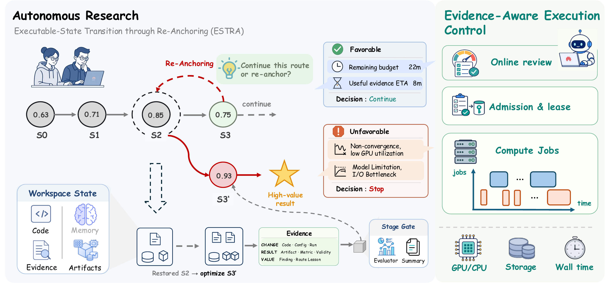

<h1 align="center">ScienceFlow</h1>

<p align="center"><b>An End-to-End Autoresearch Agent Framework</b></p>

<p align="center">
  <a href="https://www.noahlab.com.hk/news/212"><b>Project News</b></a>
  ·
  <a href="https://arxiv.org/abs/2608.14354"><b>Paper (arXiv)</b></a>
  ·
  <a href="doc/README_CN.md"><b>Chinese</b></a>
</p>

ScienceFlow is an end-to-end autoresearch agent framework for productive, stable, and goal-aligned research over hours or days. It organizes research around recoverable executable workspaces, coupling persistent state, adaptive exploration, and evidence-aware execution control so agents can continue, redirect, or recover without losing validated progress.

Across machine learning, scientific modeling, and mathematical optimization, ScienceFlow sustains effective long-horizon research and reaches **70.22 ± 1.18% Any-Medal** on the full 75-task MLE-bench within a 24-hour budget, exceeding the strongest reported baseline by **4.92 percentage points**.

<p align="center">
  
</p>
<p align="center"><sub><b>Figure 1a. Full MLE-bench Any-Medal leaderboard.</b> Mean ± SEM over three independent runs for ScienceFlow.</sub></p>

## News

- **[2026-08]** ScienceFlow is open source — the framework code, task packages, and documentation are available in this repository.
- **[2026-08]** The ScienceFlow paper is available on [arXiv](https://arxiv.org/abs/2608.14354).

## Core concepts

1. **Recoverable executable state.** Each persistent LNR worker advances research in an isolated executable workspace. An archived state binds that workspace to compact memory, validation evidence, and resource records.
2. **Stage Gate.** A task-specific result signal invokes `GateService`: the configured Evaluator produces normalized evidence, and the Gate policy decides admission. An accepted result materializes an immutable Stage with ledger facts and a recoverable workspace snapshot.
3. **ESTRA.** At a research boundary, Executable-State Transition through Re-Anchoring makes a two-axis decision: a start point (the current workspace or an archived Stage) and an intent (`continue` or `redirect`). Selecting an archived start point restores its executable state before the next research segment.
4. **Persistent memory.** Add records accepted Stage progress. Fold keeps recent, best-validated, and anchor-relevant evidence explicit while summarizing older records; Unfold/restore retrieves indexed evidence and state, and Assemble constructs the anchor-specific context for the next segment.
5. **Evidence-aware execution control.** Research workers choose scientific routes, while the controller admits, leases, monitors, timeboxes, and stops physical jobs using resource availability, remaining budget, validated progress, and recoverability. Valid worker states are finalized under `merge/finals/final_*`.

## System architecture

<p align="center">
  
</p>
<p align="center"><sub><b>Figure 2. ScienceFlow system architecture.</b> Research workers operate over recoverable executable states and adapt long-horizon trajectories through boundary-triggered ESTRA transitions, while evidence-aware execution control coordinates physical resource allocation and runtime execution.</sub></p>

## Design boundaries

- LNR is **no-skill by default**: `lnr_skill_tool_enabled: false` and `lnr_skill_auto_read: false`.
- `.scienceflow/skills/data_processing/` is retained only for the dedicated data-prep agent and validation-split workflow.
- `auto` is the default evaluator backend and resolves registered tasks to `task_package`; `artifact_command` remains available for generic command-based evaluation.
- Parallel runs bind CPU/GPU resources at task level, then split CPU capacity across workers. GPU leases support controlled sharing by multiple workers.
- Result signals may create Stages without a submission when the task contract permits it. Merge can only emit finals from candidates that carry the required artifact.

## Repository layout

```text
ScienceFlow/
├── scienceflow/                         # Framework runtime
│   ├── core/                            # Agent runtime, tools, memory, and execution
│   ├── solver/                          # LNR, Stage lifecycle, ESTRA, resume, and merge
│   ├── gates/                           # Stage Gate and Evaluator plugins
│   ├── safety/                          # Evidence-aware resource and execution control
│   ├── ui/                              # Monitor and trace interfaces
│   ├── config/                          # Defaults and example manifests
│   ├── utils/                           # Shared runtime utilities
│   └── cli.py                           # Command-line entry point
├── tasks/                               # Task packages and evaluators
├── scripts/                             # Maintained run and monitor manifests
├── .scienceflow/skills/data_processing/ # Data-preparation skills
└── doc/scienceflow/                     # Detailed architecture documentation
```

## Installation

**Requirements:** Python 3.11+ and [uv](https://docs.astral.sh/uv/).

```bash
# Install uv if you do not have it yet
curl -LsSf https://astral.sh/uv/install.sh | sh   # or: pip install uv

# Clone the repository and enter the project
git clone https://github.com/science-learner/ScienceFlow.git
cd ScienceFlow

# Configure LLM credentials
cp env.example .env   # then edit .env: set API_KEY and BASE_URL for your provider

# Create .venv and install the locked environment
uv sync
```

Notes:

- `uv sync` installs the locked `uv.lock` environment, including the in-repo `deepcraft` subpackages, the official `mlebench` Git revision, and the full test/ML stack.
- SciModelingBench support is an optional extra: `uv sync --extra scientific-design`.
- Run commands either via `uv run ...` or by using `.venv/bin/python` directly.

## Quick start

Start an interactive research REPL:

```bash
uv run python -m scienceflow.cli repl
```

Run the maintained two-worker Nomad2018 example:

```bash
uv run python -m scienceflow.cli parallel -m scripts/lnr.yaml -j 1
```

Monitor an existing run:

```bash
uv run python -m scienceflow.cli monitor --manifest scripts/lnr.yaml --refresh 5
```

Prepare a dataset with the dedicated data-prep agent:

```bash
uv run python -m scienceflow.cli parallel -m scripts/prep.yaml -j 1
```

Run the self-contained Circle Packing math-optimization example (no dataset or optional extra required):

```bash
uv run python tasks/opt_solver/_tools/prepare_math_opt_solver_tasks.py
uv run python -m scienceflow.cli parallel \
  -m scienceflow/config/examples/tasks_circle_packing_example.yaml -j 1
```

The prepare step writes a tiny task package (`problem.json` plus a valid baseline) under `./data/opt_solver/`. The agent then iteratively improves `artifacts/best_solution.json`, and the system-side evaluator authoritatively validates each candidate and scores it by the sum of radii.

## Configuration essentials

| Setting | Purpose |
|---|---|
| `lnr.num_workers` | Number of persistent research workers inside one task. |
| `task.cpu_list` / `task.gpu_list` | Task-level CPU and GPU resource boundaries; LNR further splits CPU across workers. |
| `lnr.omp_threads_cap` | CPU thread cap for each worker slice. |
| `lnr.wall_clock_budget_sec` | Total wall-clock budget for the LNR process. |
| `lnr.estra_enabled` / `estra_trigger_stage_count` | Enables ESTRA and sets the trigger for boundary review and context folding. |
| `lnr.resource_runtime_enabled` | Enables evidence-aware resource and execution control. |
| `resume_budget_policy` | Budget accounting for resumed runs; `fresh` adds this round's `time_limit` on top of accumulated time. |
| `evaluator.backend` | Selects `auto` (default), `task_package`, or `artifact_command`. |
| `evaluator.stage_source_mode` | Selects the `shadow`, `adjudicate`, or `primary` Stage source mode. |
| `evaluator.command.python_executable` | Points a task at an isolated Python environment. |
| `profile_overrides.<profile>` | Overrides prompts, Evaluator, and resource behavior per task type. |
| `tasks/**/task.yaml` | Declares the task-level artifact, metric, provider/profile, Evaluator, and Gate policy. |
| `metric.authoritative: true` | Marks a metric as authoritative evidence eligible for high-trust selection. |

## Documentation

[Architecture overview](doc/scienceflow/index.html) · [Recoverable states and LNR](doc/scienceflow/module-lnr.html) · [Evidence-aware execution control](doc/scienceflow/module-resource.html) · [Adding opt-solver tasks](doc/scienceflow/module-opt-solver-onboarding.html) · [Scientific modeling example](tasks/sci_modeling_bench/tfbind8-black-box-v1/README.md)

## Paper task coverage

The paper evaluates the same ScienceFlow workflow across three classes of executable research tasks:

- **Machine learning engineering:** all 75 [MLE-bench](https://github.com/openai/mle-bench) tasks through the pipeline-construction interface.
- **Scientific modeling and design:** 12 [SciModelingBench tasks on Hugging Face](https://huggingface.co/datasets/sci-modeling-bench/design-bench) through the candidate-optimization interface.
- **Mathematical and engineering optimization:** [Circle Packing](https://github.com/algorithmicsuperintelligence/openevolve/tree/main/examples/circle_packing), [Ratio Minimization](https://github.com/algorithmicsuperintelligence/openevolve/tree/main/examples/alphaevolve_math_problems/minimizing_max_min_dist), [Uncertainty Inequality](https://github.com/algorithmicsuperintelligence/openevolve/tree/main/examples/alphaevolve_math_problems/uncertainty_ineq), and the easy, medium, and hard [SpOC4 KTTSP](https://www.esa.int/gsp/ACT/news/spoc-2026/) tracks through the candidate-optimization interface.

All task families share the Stage Gate and Evaluator contract. Each `task.yaml` keeps provider/profile, artifact schema, metric direction, evaluator backend, authoritative status, and Gate policy outside the generic solver.

## Operational notes

- MLE-bench tasks require the data root, task `exp_id`, and `submission.csv` contract to be aligned.
- Do not resume old workspaces across different task profiles, or prompts, datasets, or artifact dimensions may be inherited incorrectly.
- `stopped_by_user` marks a resumable terminal state from a manual stop, not a failure; a later resume should continue from the accumulated budget in `state.json` and the workspace stages.

## Verification

```bash
uv run pytest -q
```

The project uses Python 3.11+, Pydantic, OmegaConf, Click, and Rich. The official `mlebench` dependency is pinned to a Git revision in `uv.lock`; the optional `scientific-design` extra provides SciModelingBench, Datasets, and PyArrow support. Command-based optimization tasks may use a separate Python environment injected through the evaluator configuration, with task-specific schema/scoring logic kept inside the `tasks/<category>/...` task package.
