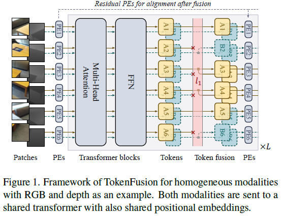
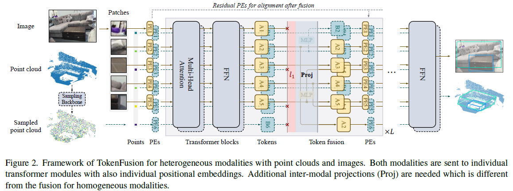

# Multimodal Token Fusion for Vision Transformers (CVPR 2022)

By Yikai Wang, Xinghao Chen, Lele Cao, Wenbing Huang, Fuchun Sun, Yunhe Wang.

[**[Paper]**](https://openaccess.thecvf.com/content/CVPR2022/html/Wang_Multimodal_Token_Fusion_for_Vision_Transformers_CVPR_2022_paper.html)

This repository is a PyTorch implementation of "Multimodal Token Fusion for Vision Transformers", in CVPR 2022. 

<div align="center">
   
</div>

<div align="center">
   
</div>

## Other implementations

- Official Mindspore Code: https://gitee.com/mindspore/models/tree/master/research/cv/TokenFusion
- Pytorch Code: https://github.com/yikaiw/TokenFusion

## Datasets

For semantic segmentation task on NYUDv2 ([official dataset](https://cs.nyu.edu/~silberman/datasets/nyu_depth_v2.html)), we provide a link to download the dataset [here](https://drive.google.com/drive/folders/1mXmOXVsd5l9-gYHk92Wpn6AcKAbE0m3X?usp=sharing). The provided dataset is originally preprocessed in this [repository](https://github.com/DrSleep/light-weight-refinenet), and we add depth data in it.

For image-to-image translation task, we use the sample dataset of [Taskonomy](http://taskonomy.stanford.edu/), where a link to download the sample dataset is [here](https://github.com/alexsax/taskonomy-sample-model-1.git).

Please modify the data paths in the codes, where we add comments 'Modify data path'.


## Dependencies
```
python==3.6
pytorch==1.7.1
torchvision==0.8.2
numpy==1.19.2
```


## Semantic Segmentation


First, 
```
cd semantic_segmentation
```
Training script for segmentation with RGB and Depth input,
```
python main.py --backbone mit_b3 -c exp_name --lamda 1e-6 --gpu 0 1 2
```

Evaluation script,
```
python main.py --gpu 0 --resume path_to_pth --evaluate  # optionally use --save-img to visualize results
```

Checkpoint models, training logs, mask ratios and the **single-scale** performance on NYUDv2 are provided as follows:

| Method | Backbone | Pixel Acc. (%) | Mean Acc. (%) | Mean IoU (%) | Download |
|:-----------:|:-----------:|:-----------:|:-----------:|:-----------:|:-----------:|
|[CEN](https://github.com/yikaiw/CEN)| ResNet101 | 76.2 | 62.8 | 51.1 | [Google Drive](https://drive.google.com/drive/folders/1wim_cBG-HW0bdipwA1UbnGeDwjldPIwV?usp=sharing)|
|[CEN](https://github.com/yikaiw/CEN)| ResNet152 | 77.0 | 64.4 | 51.6 | [Google Drive](https://drive.google.com/drive/folders/1DGF6vHLDgBgLrdUNJOLYdoXCuEKbIuRs?usp=sharing)|
|TokenFusion (Ours)| SegFormer-B3 | 78.7 | 67.5 | 54.8 | [Google Drive](https://drive.google.com/drive/folders/14fi8aABFYqGF7LYKHkiJazHA58OBW1AW?usp=sharing)|


## Image-to-Image Translation

First, 
```
cd image2image_translation
```
Training script, from Shade and Texture to RGB,
```
python main.py --gpu 0 -c exp_name
```
This script will auto-evaluate on the validation dataset every 5 training epochs. 

Predicted images will be automatically saved during training, in the following folder structure:

```
code_root/ckpt/exp_name/results
  ├── input0  # 1st modality input
  ├── input1  # 2nd modality input
  ├── fake0   # 1st branch output 
  ├── fake1   # 2nd branch output
  ├── fake2   # ensemble output
  ├── best    # current best output
  │    ├── fake0
  │    ├── fake1
  │    └── fake2
  └── real    # ground truth output
```

Checkpoint models:

| Method | Task | FID | KID | Download |
|:-----------:|:-----------:|:-----------:|:-----------:|:-----------:|
| [CEN](https://github.com/yikaiw/CEN) |Texture+Shade->RGB | 62.6 | 1.65 | - |
| TokenFusion (Ours) | Texture+Shade->RGB | 45.5 | 1.00 | [Google Drive](https://drive.google.com/drive/folders/1vkcDv5bHKXZKxCg4dC7R56ts6nLLt6lh?usp=sharing)|

## Citation

If you find our work useful for your research, please consider citing the following paper.
```
@inproceedings{wang2022tokenfusion,
  title={Multimodal Token Fusion for Vision Transformers},
  author={Wang, Yikai and Chen, Xinghao and Cao, Lele and Huang, Wenbing and Sun, Fuchun and Wang, Yunhe},
  booktitle={IEEE Conference on Computer Vision and Pattern Recognition (CVPR)},
  year={2022}
}
```


