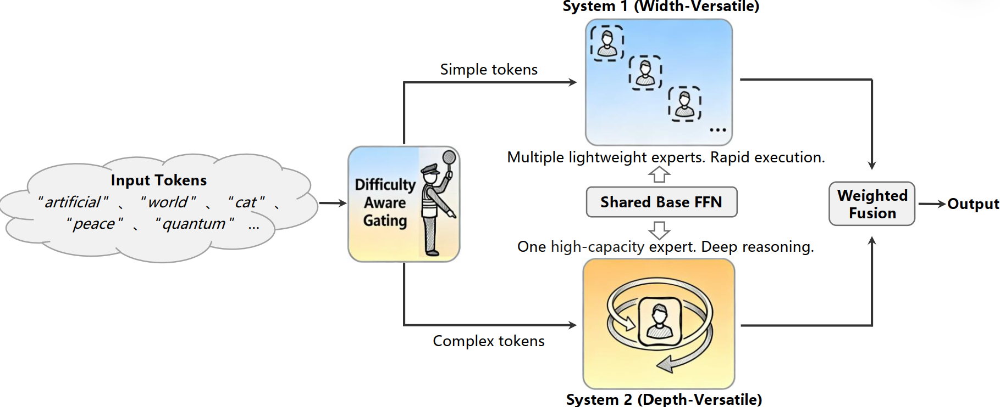

# VersatileFFN: Achieving Parameter Efficiency in LLMs via Adaptive Wide-and-Deep Reuse
By Ying Nie, Kai Han, Hongguang Li, Hang Zhou, Tianyu Guo, Enhua Wu, Xinghao Chen and Yunhe Wang.  [[arXiv]](https://arxiv.org/abs/2512.14531)

## Overview

**VersatileFFN** is a novel feed-forward network (FFN) that enables flexible reuse of parameters in both width and depth dimensions within a fixed parameter budget. VersatileFFN comprises two adaptive pathways: a width-versatile path that generates a mixture of sub-experts from a single shared FFN, mimicking sparse expert routing without increasing parameters, and a depth-versatile path that recursively applies the same FFN to emulate deeper processing for complex tokens. A difficulty-aware gating dynamically balances the two pathways, steering “easy” tokens through the efficient width-wise route and allocating deeper iterative refinement to “hard” tokens.

<div align="center">
  
</div><br/>


## Installation
We employ [OLMo](https://github.com/allenai/OLMo/tree/main) as the framework of training and evaluation:
1. Install from source:
```
git clone https://github.com/allenai/OLMo.git
cd OLMo
pip install -e .[all]
```
2. Install dolma for tokenizing training data:
```
pip install dolma
```

## Runing Code
1. Download the data of fineweb-edu-100b from https://huggingface.co/datasets/HuggingFaceFW/fineweb-edu/tree/main/sample/100BT, convert the data format from parquet to jsonl via:
```
python utils/parquet2jsonl.py
```
2. Tokenize the converted data via:
```
dolma tokens \
--documents ${PATH_TO_DATA} \
--destination ${PATH_WHERE_TO_SAVE_TOKENIZED_DATA} \
--tokenizer.name_or_path 'allenai/gpt-neox-olmo-dolma-v1_5' \
--max_size '2_147_483_648' \
--seed 0 \
--tokenizer.eos_token_id 50279 \
--tokenizer.pad_token_id 1 \
--processes ${NUMBER_OF_CPU_CORES_TO_USE}
```
3. Replace olmo/model.py in this repository with the corresponding position and run:
```
torchrun --nproc_per_node=8 scripts/train.py configs/model_config.yaml
```

## Citation

If you find this work useful, please cite our paper:

```bibtex
@misc{nie2025versatileffnachievingparameterefficiency,
      title={VersatileFFN: Achieving Parameter Efficiency in LLMs via Adaptive Wide-and-Deep Reuse}, 
      author={Ying Nie and Kai Han and Hongguang Li and Hang Zhou and Tianyu Guo and Enhua Wu and Xinghao Chen and Yunhe Wang},
      year={2025},
      eprint={2512.14531},
      archivePrefix={arXiv},
      primaryClass={cs.CL},
      url={https://arxiv.org/abs/2512.14531}, 
}
```
## Acknowledgements
We appreciate the following code bases and conceptual inspiration: [OLMo](https://github.com/allenai/OLMo/tree/main), [OLMoE](https://github.com/allenai/OLMoE).
