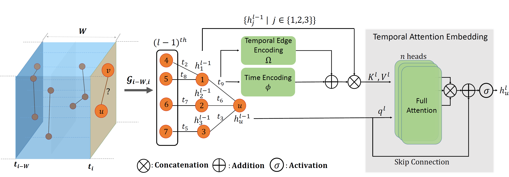
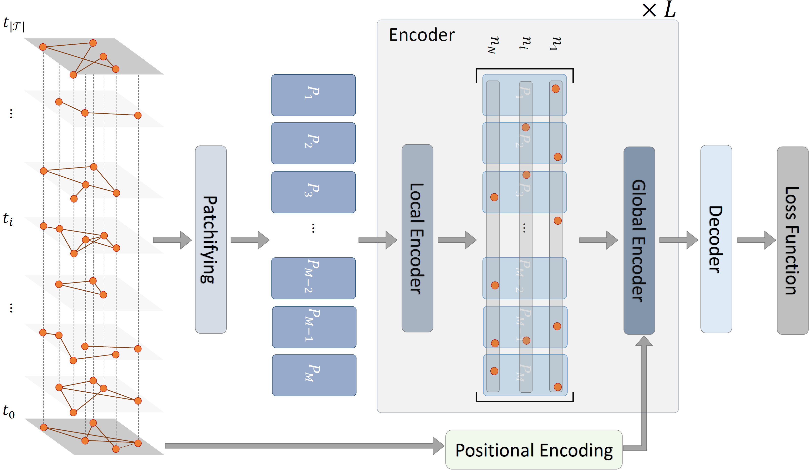

# Graph Atlas 

This directory contains official implementations for Graph Atlas, which aims for efficient dynamic graph representation.  This work is developed by Huawei Noah's Ark Lab.

## [DyG2Vec: Efficient Representation Learning for Dynamic Graphs](DyG2Vec)

### Abstract

Temporal graph neural networks have shown promising results in learning inductive representations by automatically extracting temporal patterns. However, previous works often rely on complex memory modules or inefficient random walk methods to construct temporal representations. To address these limitations, we present an efficient yet effective attention-based encoder that leverages temporal edge encodings and window-based subgraph sampling to generate task-agnostic embeddings. Moreover, we propose a joint-embedding architecture using non-contrastive SSL to learn rich temporal embeddings without labels. Experimental results on 7 benchmark datasets indicate that on average, our model outperforms SoTA baselines on the future link prediction task by 4.23\% for the transductive setting and 3.30\% for the inductive setting while only requiring 5-10x less training/inference time. Lastly, different aspects of the proposed framework are investigated through experimental analysis and ablation studies. 

Paper accepted at TMLR 2023: https://openreview.net/forum?id=YRKS2J0x36

## [Todyformer: Towards Holistic Dynamic Graph Transformers with Structure-Aware Tokenization](TodyFormer)

### Abstract

Temporal Graph Neural Networks have garnered substantial attention for their capacity to model evolving structural and temporal patterns while exhibiting impressive performance. However, it is known that these architectures are encumbered by issues that constrain their performance, such as over-squashing and oversmoothing. Meanwhile, Transformers have demonstrated exceptional computational capacity to effectively address challenges related to long-range dependen-cies. Consequently, we introduce Todyformer—a novel Transformer-based neural network tailored for dynamic graphs. It unifies the local encoding capacity of Message-Passing Neural Networks (MPNNs) with the global encoding of Transformers through i) a novel patchifying paradigm for dynamic graphs to improve over-squashing, ii) a structure-aware parametric tokenization strategy leveraging MPNNs, iii) a Transformer with temporal positional-encoding to capture long-range dependencies, and iv) an encoding architecture that alternates between localand global contextualization, mitigating over-smoothing in MPNNs. Experimental evaluations on public benchmark datasets demonstrate that Todyformer consistently outperforms the state-of-the-art methods for downstream tasks. Furthermore, we illustrate the underlying aspects of the proposed model in effectively
capturing extensive temporal dependencies in dynamic graphs.

Paper accepted at NeurIPS TGL Workshop 2023: https://openreview.net/forum?id=13jswzpMI8
