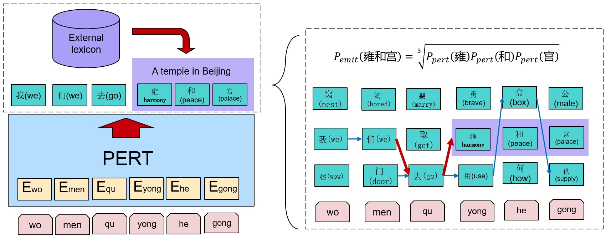

# PERT

PERT is a solution for pinyin-to-character conversion task which is core to the Chinese input method. It adopts transformer-based network, especially the NEZHA language model, whose outperforms the n-gram and RNN models significantly. Besides, it can incorporate the n-gram and the external lexicon to adapt out of domain. 



## Setup

---

```bash
# Create python environment (optional)
conda create -n pert python=3.6.5
source activate pert

# Install python dependencies
pip install -r requirements.txt
```

## Train

--- 

We use Trainer.py to train the PERT model. Here is an example: 

```bash
CUDA_VISIBLE_DEVICES='0' nohup python Trainer.py \
   --vocab "./Corpus/CharListFrmC4P.txt" \
   --pyLex "./Corpus/pinyinList.txt" \
   --chardata "./Corpus/train_texts_CharSeg_1k.txt" \
   --pinyindata "./Corpus/train_texts_pinyin_1k.txt" \
   --num_loading_workers 2 \
   --prefetch_factor 1 \
   --bert_config "./Configs/bert_config_tiny_nezha_py.json" \
   --train_batch_size 2048 \
   --seq_length 16 \
   --num_epochs 10 \
   --continue_train_index 0 \
   --save "./Models/pert_tiny_py_lr5e4_2kBs_10e/" \
   --save_per_n_epoches 1 \
   > "./Logs/Training_pert_tiny_py_lr5e4_2kBs_10e_log.txt" 2>&1 &
```

## Evaluate

--- 

We use py2wordPert.py to evaluate the PERT model. Here is an example:

```bash
CUDA_VISIBLE_DEVICES='0' nohup python py2wordPert.py \
   --charLex "./Corpus/CharListFrmC4P.txt" \
   --pyLex "./Corpus/pinyinList.txt" \
   --pinyin2PhrasePath "./Corpus/ModernChineseLexicon4PinyinMapping.txt" \
   --bigramModelPath "./Models/Bigram/Bigram_CharListFrmC4P.json" \
   --modelPath "./Models/pert_tiny_py_lr5e4_2kBs_10e/" \
   --charFile "./Corpus/train_texts_CharSeg_1k.txt" \
   --pinyinFile "./Corpus/train_texts_pinyin_1k.txt" \
   --conversionRsltFile "./Logs/Eval_rslt_pert_tiny_py_lr5e4_2kBs_10e_log.txt" \
   > "./Logs/Eval_pert_tiny_py_lr5e4_2kBs_10e_log.txt" 2>&1 &
```

## Directory structure

---

```
PERT
│── Trainer.py (To train PERT)
│── py2wordPert.py (To do the Pinyin-to-character conversion task by PERT)
│── PinyinCharDataProcesser.py (To provide the dataset)
│── run_train.sh (Shell script to train PERT)
│── run_eval.sh (Shell script to evaluate PERT)
│
├── NEZHA (The NEZHA language model)
│
├── Configs (The configurations to train PERT at various scals)
│
├── Corpus (The necessary lexicon and the example corpus)
│   ├── CharListFrmC4P.txt (The list of Chinese characters)
│   ├── pinyinList.txt (The list of pinyin tokens)
│   │
│   ├── ModernChineseLexicon4PinyinMapping.txt (The word items and the corresponding pinyin tokens in Modern Chinese Lexicon)
│   │
│   ├── train_texts_CharSeg_1k.txt (The example corpus of Chinese character)
│   │
│   └── train_texts_pinyin_1k.txt (The example corpus of pinyin)
│
└── Models 
    ├── Bigram (The Bigram model trained on some news corpus)
    └── pert_tiny_py_lr5e4_2kBs_10e (The PERT model trained on some news corpus under the conditions of learning rate: 5e4, batch size: 2048, and epoch number: 10)
```

## Reference

---

Please cite our paper if you use our models in your works:
```
@article{DBLP:journals/corr/abs-2205-11737,
  author    = {Jinghui Xiao and
               Qun Liu and
               Xin Jiang and
               Yuanfeng Xiong and
               Haiteng Wu and
               Zhe Zhang},
  title     = {{PERT:} {A} New Solution to Pinyin to Character Conversion Task},
  journal   = {CoRR},
  volume    = {abs/2205.11737},
  year      = {2022},
  url       = {https://doi.org/10.48550/arXiv.2205.11737},
  doi       = {10.48550/arXiv.2205.11737},
  eprinttype = {arXiv},
  eprint    = {2205.11737},
  timestamp = {Mon, 30 May 2022 15:47:29 +0200},
  biburl    = {https://dblp.org/rec/journals/corr/abs-2205-11737.bib},
  bibsource = {dblp computer science bibliography, https://dblp.org}
}
```
【This open source project is not an official Huawei product, Huawei is not expected to provide support for this project.】