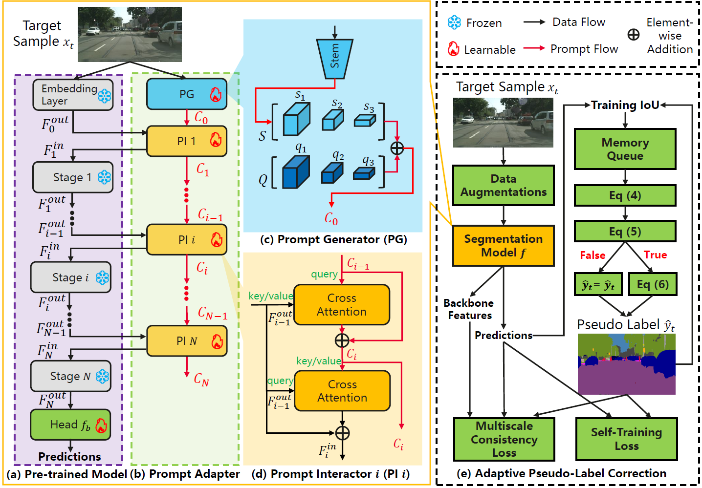

# When Visual Prompt Tuning Meets Source-Free Domain Adaptive Semantic Segmentation

## Introduction
Source-free domain adaptive semantic segmentation aims to adapt a pre-trained source model to the unlabeled target domain without accessing the private source data. Previous methods usually fine-tune the entire network, which suffers from expensive parameter tuning. To avoid this problem, we propose to utilize visual prompt tuning for parameter-efficient adaptation. However, the existing visual prompt tuning methods are unsuitable for source-free domain adaptive semantic segmentation due to the following two reasons: (1) Commonly used visual prompts like input tokens or pixel-level perturbations cannot reliably learn informative knowledge beneficial for semantic segmentation. (2) Visual prompts require sufficient labeled data to fill the gap between the pre-trained model and downstream tasks. To alleviate these problems, we propose a universal unsupervised visual prompt tuning (Uni-UVPT) framework, which is applicable to various transformer-based backbones. Specifically, we first divide the source pre-trained backbone with frozen parameters into multiple stages, and propose a lightweight prompt adapter for progressively encoding informative knowledge into prompts and enhancing the generalization of target features between adjacent backbone stages. Cooperatively, a novel adaptive pseudo-label correction strategy with a multiscale consistency loss is designed to alleviate the negative effect of target samples with noisy pseudo labels and raise the capacity of visual prompts to spatial perturbations. 



## Setup and Environments

Please check your CUDA version and install the requirements with:

```shell
pip install -r requirements.txt
pip install mmcv-full==1.7.0 -f  https://download.openmmlab.com/mmcv/dist/{cu_version}/torch1.10.0/index.html
git clone https://github.com/chengdazhi/Deformable-Convolution-V2-PyTorch.git
sh install.sh
```


## Datasets

**Cityscapes:** Please, download leftImg8bit_trainvaltest.zip and
gt_trainvaltest.zip from [here](https://www.cityscapes-dataset.com/downloads/)
and extract them to `data/cityscapes`.

**GTA:** Download all image and label packages from
[here](https://download.visinf.tu-darmstadt.de/data/from_games/) and extract
them to `data/gta`.

**Synthia:** Please, download SYNTHIA-RAND-CITYSCAPES from
[here](http://synthia-dataset.net/downloads/) and extract it to `data/synthia`.


**Data Preprocessing:** Finally, please run the following commands to convert the label IDs to the
train IDs:

```shell
python tools/convert_datasets/gta.py data/gta --nproc 8
python tools/convert_datasets/cityscapes.py data/cityscapes --nproc 8
python tools/convert_datasets/synthia.py data/synthia/ --nproc 8
```

## Pre-Training in the source domain

(1) Download models pretrained on ImageNet-1K and put them in `model/`:
[Swin-B](https://download.openmmlab.com/mmsegmentation/v0.5/pretrain/swin/swin_base_patch4_window7_224_20220317-e9b98025.pth)
[Mit-B5](https://drive.google.com/drive/folders/1b7bwrInTW4VLEm27YawHOAMSMikga2Ia?usp=sharing)

(2) Then, a pre-training job can be launched as follows:
```shell
python pretrain.py <config_dir>
```
Please refers to `launcher_pretrain.py` for all pretraining jobs
and all source models could be downloaded from [baidu](https://pan.baidu.com/s/156HXFY3Cjoa-ngSox-tMWA?pwd=jit1) and [Google Drive](https://drive.google.com/drive/folders/1KXy4axpESMi97SHKbzw9hpeQ1fBJvb2_?usp=sharing), and must be placed in `model/`.

## Generating Pseudo Labels
Then we can generate pseudo labels using:
```shell
python generate_pseudo_label.py --config <config_dir> --checkpoint <source_model_dir> --pseudo_label_dir <citiscapes_dir>/pretrain/<source_model_name>/train/
```
Please refers to `launcher_pseudo_label.py` for all jobs.

## Training
All the preparing steps have finished, here we can train the final model using:
```shell
python train.py <config_dir>
```
Please refers to `launcher_train.py` for all training jobs.


## Testing
We have provided all checkpoints for fast evaluations.
The checkpoints could be downloaded [baidu](https://pan.baidu.com/s/156HXFY3Cjoa-ngSox-tMWA?pwd=jit1) and [Google Drive](https://drive.google.com/drive/folders/1KXy4axpESMi97SHKbzw9hpeQ1fBJvb2_?usp=sharing), and must be placed in `model/`.
```shell

python test.py <config_dir> <checkpoint_dir>  --eval mIoU
```
Please refers to `launcher_test.py` for all testing jobs.


## Results
| Model | Pretraining |Backbone| GTA5 -> Cityscapes (mIoU19) | Synthia -> Cityscapes (mIoU16)|  Synthia -> Cityscapes (mIoU13) |
|:----:|:----------:|:----:|:----:|:----:|:----:|
Ours | Standard Single Source | Swin-B | 56.2 | 52.6 | 59.4 | 
Ours | Standard Single Source | MiT-B5 | 54.2 | 52.6 | 59.3 | 
Ours | Source-GtA             | Swin-B | 56.9 | 53.8 | 60.4 |
Ours | Source-GtA             | MiT-B5 | 56.1 | 53.8 | 60.1 | 


## Citation
If this codebase is useful to you, please cite our work:
```
@article{ma2023uniuvpt,
  title={When Visual Prompt Tuning Meets Source-Free Domain Adaptive Semantic Segmentation},
  author={Xinhong Ma and Yiming Wang and Hao Liu and Tianyu Guo and Yunhe Wang},
  journal={Advances in Neural Information Processing Systems},
  year={2023},
}
```
